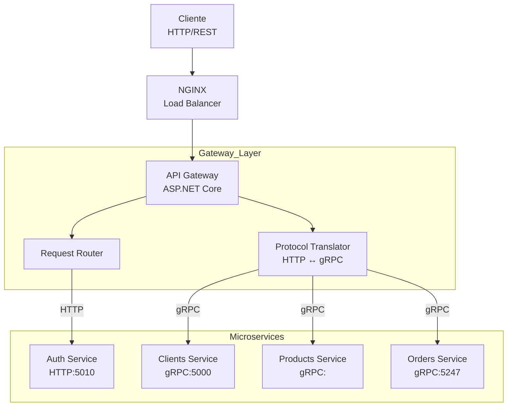

# Censudex - API Gateway

Punto de entrada único y centralizado para todos los microservicios de la plataforma de retail Censudex.

## Arquitectura y Patrón de Diseño

### Arquitectura: API Gateway con Balanceador de Carga



### Patrones de Diseño Implementados:

1. **Gateway Aggregation Pattern:** Agrega múltiples solicitudes a servicios backend
2. **Gateway Routing Pattern:** Enruta solicitudes al microservicio apropiado
3. **Gateway Offloading Pattern:** Centraliza autenticación y autorización

## Tecnologías Utilizadas

- .NET 9.0
- Visual Studio Code 1.95.3 o superior

## Instalación
1.- Primero debemos abrir la consola de comandos apretando las siguientes teclas y escribir 'cmd':

- "Windows + R" y escribimos 'cmd'

2.- Ahora debemos crear una carpeta en donde guardar el proyecto, esta carpeta puede estar donde desee el usuario:
```bash
mkdir [NombreDeCarpeta]
```
3.- Accedemoss a la carpeta.
```bash
cd NombreDeCarpeta
```
4.- Se debe clonar el repositorio en el lugar deseado por el usuario con el siguiente comando:
```bash
git clone https://github.com/bxnjadev/Censudex-Api-Gateway.git
```
5.- Accedemos a la carpeta creada por el repositorio:
```bash
cd Censudex-Api-Gateway
```
6.- Ahora debemos restaurar las dependencias del proyecto con el siguiente comando:
```bash
dotnet restore
```
7.- Con las dependencias restauradas, abrimos el editor:
```bash
code .
```
8.- Establecer las credenciales del archivo .env copiando las del archivo .env.example
```bash
notepad .env
```
9.- Finalmente ya en el editor ejecutamos el siguiente comando para ejecutar el proyecto:
```bash
dotnet run
```
10.- Es necesario tener corriendo en local el servicio de clientes, auth, orders, products 


## Consultas disponibles
Se encuentran en los archivos api-gateway-orders-http.postman_collection.json, APIGateway-Clients-Auth-Services.postman_collection.json
